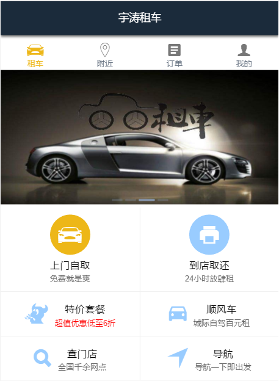
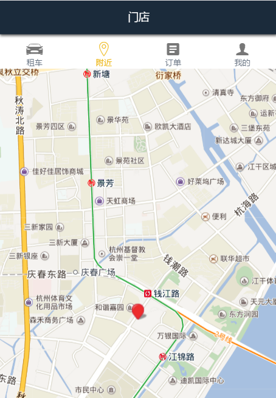
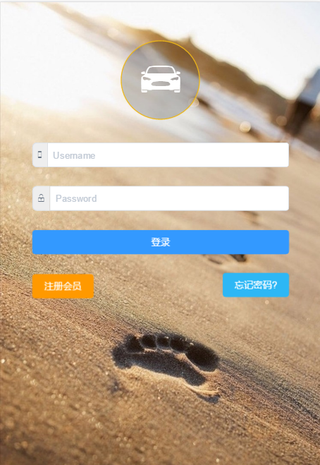
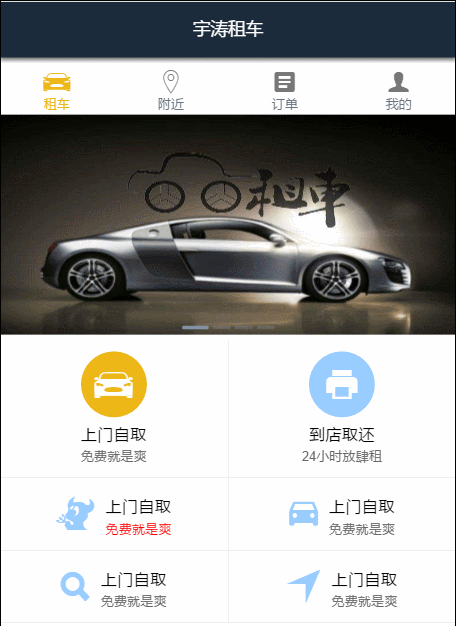

# second-car

> 毕业设计, 汽车租赁平台
> 
> SPA

## Build Setup

``` bash
# install dependencies
npm install

# serve with hot reload at localhost:8080
npm run dev

# build for production with minification
npm run build
```

## Res

### 页面





### 交互



---

## Thanks 

- [Vue.js](http://vuejs.org/)
- [iView](https://www.iviewui.com/)
- [vue2-elm](https://github.com/bailicangdu/vue2-elm)
- [神州租车-安卓版](http://www.zuche.com/)
